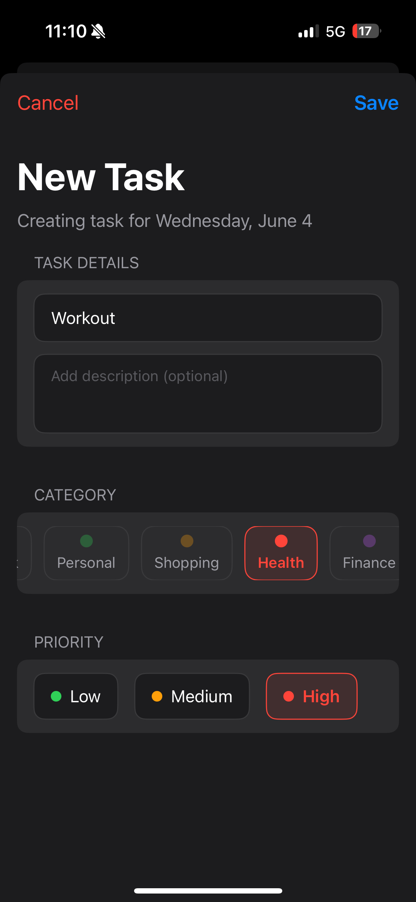
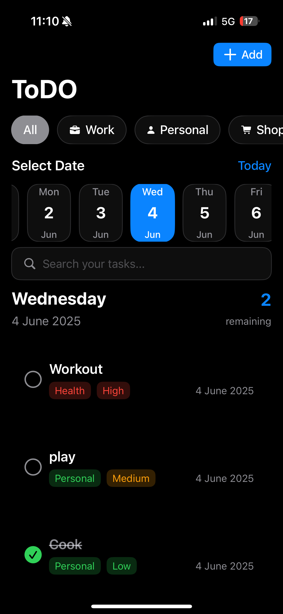
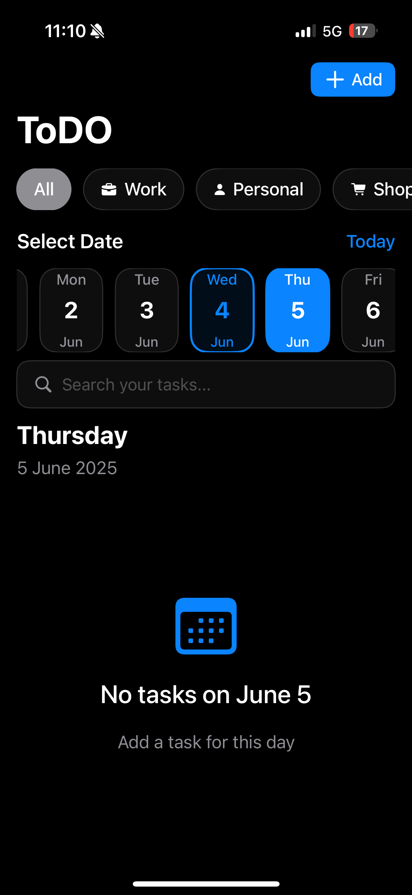
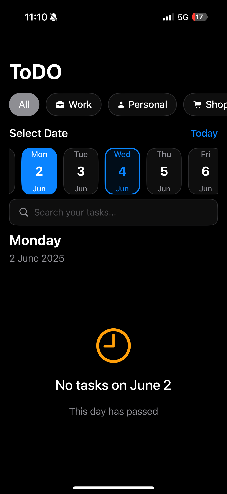
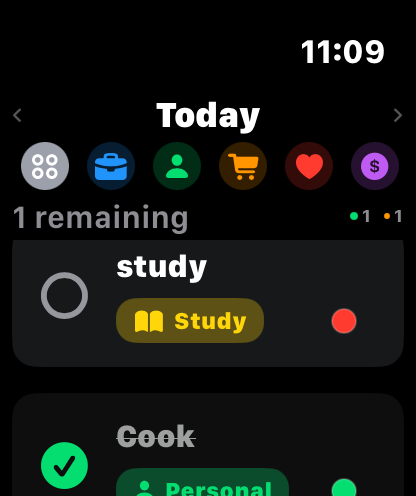
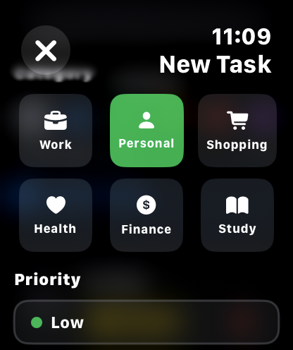
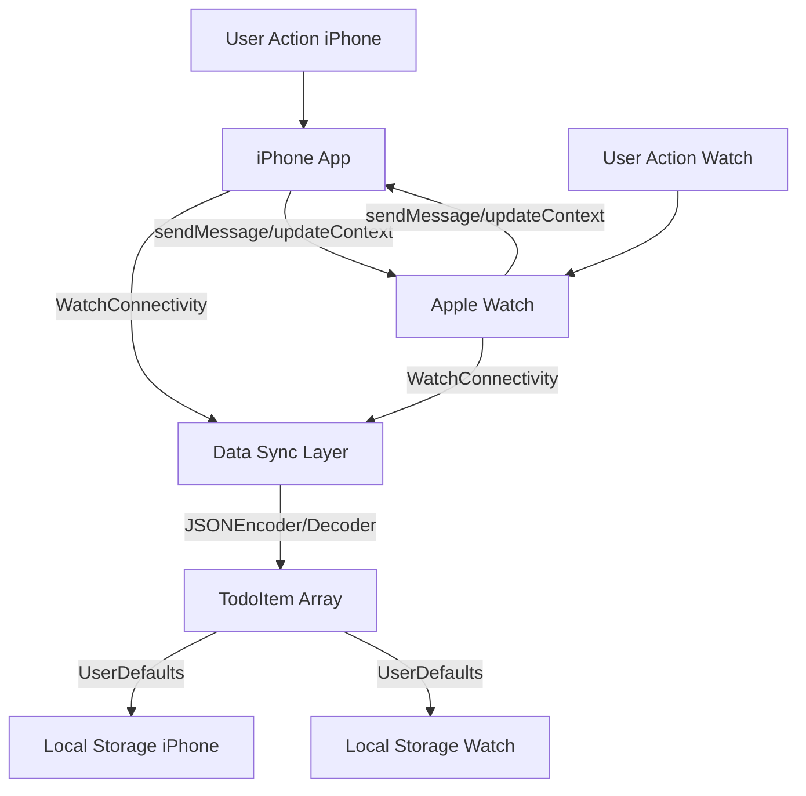

# 📝 TodoSync - Universal Task Manager

<div align="center">

**A beautifully crafted, feature-rich Todo application for iOS and watchOS with seamless real-time synchronization**


</div>

---

## 🎬 Experience the App in Action

### 📱 iPhone Experience
<div align="center">


https://github.com/user-attachments/assets/5aa77f38-5cea-4df4-b36a-6069ca250dc1


</div>

*Fluid iPhone interface showcasing task management, categories, and priority levels*

### ⌚ Apple Watch Experience  
<div align="center">


https://github.com/user-attachments/assets/0e23bcf3-b742-4cbf-a578-70b4c12a7769


</div>

*Optimized watchOS interface with Digital Crown support and instant sync*

---

## 📸 Visual Showcase

### iPhone Screenshots
<div align="center">

| Main Interface | Task Categories | Add New Task | Detailed View |
|:-------------:|:--------------:|:------------:|:-------------:|
|  |  |  |  |
| *Clean, modern task list* | *Smart categorization* | *Intuitive task creation* | *Rich task details* |

</div>

### Apple Watch Screenshots
<div align="center">

| Watch Interface | Compact View |
|:--------------:|:------------:|
|  |  |
| *Native watchOS design* | *Quick task overview* |

</div>

---

## ✨ Comprehensive Feature Overview

### 📋 **Core Task Management**
- **Create, Edit & Delete**: Full CRUD operations with intuitive interfaces
- **Smart Scheduling**: Schedule tasks for specific dates with calendar integration
- **Completion Tracking**: One-tap completion with visual feedback
- **Rich Descriptions**: Add detailed notes and context to your tasks

### 🏷️ **Intelligent Categorization**
Choose from 6 beautifully designed categories:
- 💼 **Work** - Professional tasks and projects
- 👤 **Personal** - Personal goals and reminders  
- 🛒 **Shopping** - Shopping lists and purchases
- ❤️ **Health** - Fitness goals and health reminders
- 💰 **Finance** - Financial tasks and payments
- 📚 **Study** - Learning goals and academic tasks

### ⭐ **Priority Management**
Three-tier priority system with visual indicators:
- 🔴 **High Priority** - Urgent and important tasks
- 🟡 **Medium Priority** - Standard tasks
- 🟢 **Low Priority** - Nice-to-have tasks

### 📱 **Cross-Platform Excellence**

#### iPhone Features:
- **Large, Readable Interface**: Optimized for touch interaction
- **Swipe Gestures**: Intuitive swipe-to-complete and swipe-to-delete
- **Rich Visual Design**: Beautiful gradients and animations
- **Date Navigation**: Easy date switching with visual date chips
- **Category Filtering**: Filter tasks by category with visual chips
- **Progress Tracking**: Visual progress indicators and statistics

#### Apple Watch Features:
- **Native watchOS Design**: Perfectly optimized for small screens
- **Digital Crown Navigation**: Smooth scrolling with haptic feedback
- **Quick Actions**: Tap to complete, swipe gestures for actions
- **Complication Support**: Quick task count on watch face
- **Offline Capability**: Works independently when iPhone is not nearby
- **Voice Input**: Dictation support for hands-free task creation

### 🔄 **Real-time Synchronization**
Powered by **WatchConnectivity Framework**:
- **Instant Sync**: Changes appear immediately on both devices
- **Bidirectional Updates**: Edit from either device seamlessly
- **Conflict Resolution**: Smart merging of concurrent changes
- **Background Transfer**: Sync continues even when devices are disconnected
- **Reliable Delivery**: Guaranteed delivery with fallback mechanisms

### 💾 **Robust Data Persistence**
- **JSON File Storage**: Efficient file-based persistence for task data
- **Crash Recovery**: Data survives app crashes and device restarts
- **Efficient Encoding/Decoding**: Swift Codable for high-performance JSON serialization
- **Data Integrity**: Consistent data structures across platforms

### 🎨 **Modern User Experience**
- **SwiftUI Framework**: Native, declarative UI with smooth animations
- **Dark Mode Support**: Seamless appearance adaptation
- **Accessibility**: VoiceOver and accessibility feature support
- **Haptic Feedback**: Tactile responses for important actions
- **Visual Feedback**: Color-coded priorities and status indicators

---

## 🏗️ Technical Architecture

### 📱 **iOS Application Stack**
```
┌─────────────────────────────────────┐
│            SwiftUI Views            │
│  ┌─────────────┐ ┌─────────────────┐│
│  │ ContentView │ │   AddTodoView   ││
│  │ TodoRowView │ │ EditTodoView    ││
│  └─────────────┘ └─────────────────┘│
├─────────────────────────────────────┤
│          Data Management            │
│  ┌─────────────┐ ┌─────────────────┐│
│  │TodoData-    │ │WatchConnectivity││
│  │Manager      │ │Manager          ││
│  └─────────────┘ └─────────────────┘│
├─────────────────────────────────────┤
│           Data Models               │
│  ┌─────────────┐ ┌─────────────────┐│
│  │  TodoItem   │ │  TodoCategory   ││
│  │TodoPriority │ │ SyncConstants   ││
│  └─────────────┘ └─────────────────┘│
├─────────────────────────────────────┤
│         Frameworks & APIs           │
│    SwiftUI • Combine • Foundation   │
│       UserDefaults • WatchKit       │
└─────────────────────────────────────┘
```

### ⌚ **watchOS Application Stack**
```
┌─────────────────────────────────────┐
│         Watch-Optimized Views       │
│  ┌─────────────┐ ┌─────────────────┐│
│  │ ContentView │ │   AddTodoView   ││
│  │ TodoRowView │ │   StatsView     ││
│  └─────────────┘ └─────────────────┘│
├─────────────────────────────────────┤
│       Watch Data Management         │
│  ┌─────────────┐ ┌─────────────────┐│
│  │TodoData-    │ │WatchConnectivity││
│  │Manager      │ │Manager          ││
│  └─────────────┘ └─────────────────┘│
├─────────────────────────────────────┤
│          Shared Models              │
│  ┌─────────────┐ ┌─────────────────┐│
│  │ TodoModels  │ │ SyncConstants   ││
│  │(Identical)  │ │   (Shared)      ││
│  └─────────────┘ └─────────────────┘│
├─────────────────────────────────────┤
│       watchOS Frameworks            │
│   SwiftUI • WatchKit • Foundation   │
│     WatchConnectivity • UserDefaults│
└─────────────────────────────────────┘
```

### 🔄 **Synchronization Flow**


## 📂 Project Structure

```
ToDO/
├── ToDO/                          # iOS App
│   ├── Views/                     # SwiftUI Views
│   ├── Managers/                  # Data and Connectivity Managers
│   ├── Models/                    # Data Models
│   └── Assets.xcassets/           # App Icons and Images
├── ToDOWatch Watch App/           # watchOS App
│   ├── Views/                     # Watch-specific Views
│   ├── Managers/                  # Watch Data Managers
│   └── Models/                    # Shared Models
└── ToDOTests/                     # Unit Tests
```

## 🚀 Getting Started

### Prerequisites
- Xcode 15.0 or later
- iOS 17.0 or later
- watchOS 10.0 or later
- Apple Watch (for watch app testing)

### Installation

1. **Clone the repository**
   ```bash
   git clone https://github.com/your-username/todo-example.git
   cd todo-example
   ```

2. **Open in Xcode**
   ```bash
   open ToDO.xcodeproj
   ```

3. **Build and Run**
   - Select your target device (iPhone/Apple Watch)
   - Press `Cmd + R` to build and run

### Configuration

The app uses generic bundle identifiers that you can customize:
- iOS App: `com.example.todo`
- Watch App: `com.example.todo.watchapp`
- App Group: `group.com.example.todo`

## 🔧 Technical Details

### Synchronization
The app uses `WatchConnectivity` framework for bidirectional synchronization:
- **Immediate sync** when both devices are active
- **Background transfer** when watch is not reachable
- **Conflict resolution** based on most recent changes

### Data Models

```swift
struct TodoItem: Codable, Identifiable {
    let id: UUID
    var title: String
    var isCompleted: Bool
    var priority: TodoPriority
    var category: TodoCategory
    var createdAt: Date
}
```


## 🤝 Contributing

1. Fork the repository
2. Create your feature branch (`git checkout -b feature/amazing-feature`)
3. Commit your changes (`git commit -m 'Add amazing feature'`)
4. Push to the branch (`git push origin feature/amazing-feature`)
5. Open a Pull Request

## 📝 License

This project is licensed under the MIT License - see the [LICENSE](LICENSE) file for details.

## 🙏 Acknowledgments

- Built with SwiftUI and WatchConnectivity
- Icons from SF Symbols
- Inspiration from modern todo applications

---

### 📱 Download on the App Store
*Coming Soon*

### ⌚ Compatible with Apple Watch
*Requires iOS 17.0 and watchOS 10.0 or later*
